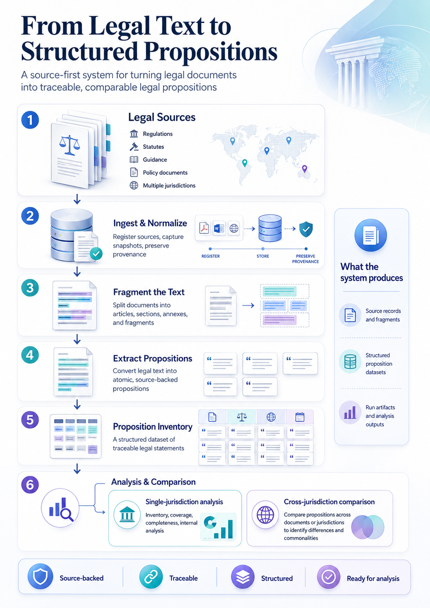

# AI EU Trade Accelerator

Two ML pipelines that work together on UK/EU legal text.

- **Judit** turns legal source text into atomic, source-backed **propositions**.
- **Beatrice** takes those law propositions plus GOV.UK guidance and produces an **overlay** that flags where the guidance confirms, omits, contradicts or is outdated against the law.

## Judit — law text → propositions

## Beatrice — propositions + guidance → overlay

