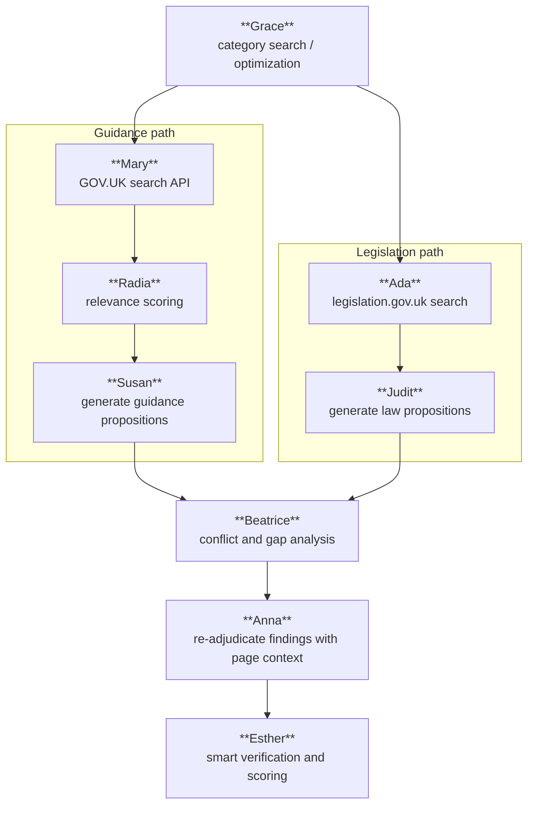

# ai-eu-trade-accelerator

A source-first content-audit pipeline that compares official UK guidance against the
underlying legislation. The pipeline starts with **Grace**, branches into a **guidance path**
and a **legislation path**, recombines at **Beatrice**, re-adjudicates at **Anna**, and
finishes with **Esther**.

## Pipeline

```mermaid
flowchart TD
    Grace["**Grace**<br/>category search / optimization"]

    Grace --> Mary
    Grace --> Ada

    subgraph guidance ["Guidance path"]
        direction TB
        Mary["**Mary**<br/>GOV.UK search API"]
        Radia["**Radia**<br/>relevance scoring"]
        Susan["**Susan**<br/>generate guidance propositions"]
        Mary --> Radia --> Susan
    end

    subgraph legislation ["Legislation path"]
        direction TB
        Ada["**Ada**<br/>legislation.gov.uk search"]
        Judit["**Judit**<br/>generate law propositions"]
        Ada --> Judit
    end

    Susan --> Beatrice
    Judit --> Beatrice

    Beatrice["**Beatrice**<br/>conflict and gap analysis"]
    Anna["**Anna**<br/>re-adjudicate findings with page context"]
    Esther["**Esther**<br/>smart verification and scoring"]

    Beatrice --> Anna --> Esther
```

## Steps

| Step | Path | What it does |
| --- | --- | --- |
| **Grace** | Entry | Category search / category optimization. Determines what to audit and branches into the two paths. |
| **Mary** | Guidance | GOV.UK search API — discovers candidate guidance content. |
| **Radia** | Guidance | Relevance scoring of the discovered guidance. |
| **Susan** | Guidance | Generates guidance propositions from the scored content. |
| **Ada** | Legislation | legislation.gov.uk search — discovers the relevant law. |
| **Judit** | Legislation | Generates law propositions from the legislation. |
| **Beatrice** | Merge | Conflict and gap analysis across the guidance and law propositions. |
| **Anna** | Merge | Re-adjudicates Beatrice's flagged findings against the rest of each page's guidance. |
| **Esther** | Output | Smart verification and scoring of the analysis. |

## Previous run (topic: "slurry")

Input size, runtime, and cost from the end-to-end "slurry" run (2026-06-25). Grace was a manual
step; Ada returned **5** legislation results, which became Judit's input. Mary/Ada/Judit inputs
were reused from the prior fetch (not re-run this pass). Costs are batch-API actuals from each
step's `metrics.json`; **Judit** does not record token cost, and Mary/Esther make no LLM calls.

| Step | Input size | Runtime | Cost |
| --- | --- | --- | --- |
| **Grace** | "slurry" (category) | Manual | Manual |
| **Mary** | → 18,487-page corpus | reused | $0 (public API) |
| **Radia** | 18,487 pages → 126 on-topic | ~42 min | $3.72 |
| **Susan** | 126 pages → 83 extracted (2,307 propositions) | ~4 min | $6.31 |
| **Ada** | legislation.gov.uk → 5 results | reused | — |
| **Judit** | 5 law results → 678 propositions | reused | Unknown (to backfill) |
| **Beatrice** | 2,307 guidance × 678 law propositions | ~17 min | $13.48 |
| **Anna** | 33 flagged findings | ~2 min | $0.12 |
| **Esther** | 83 audited pages | ~2 min | $0 (no LLM) |
| **Total** | 126 audited / 83 extracted | — | **≈ $23.63**¹ |

¹ Sum of recorded LLM costs (Radia + Susan + Beatrice + Anna). Excludes Judit (cost not
recorded) and Mary/Esther (no LLM calls).

## Components

Each step lives in its own directory:

- [`grace/`](grace/) — category search / optimization
- [`mary/`](mary/) — GOV.UK search API
- [`radia/`](radia/) — relevance scoring
- [`susan/`](susan/) — generate guidance propositions
- [`ada/`](ada/) — legislation.gov.uk search
- [`judit/`](judit/) — generate law propositions
- [`beatrice/`](beatrice/) — conflict and gap analysis
- [`anna/`](anna/) — re-adjudicate flagged findings with page context
- [`esther/`](esther/) — smart verification and scoring

## Infographic

The polished pipeline infographic is generated from a shared prompt template:

- [`docs/assets/infographics/prompt-template.md`](docs/assets/infographics/prompt-template.md)

Paste that prompt into an external image/design tool (DALL-E, Midjourney, etc.) to produce
slide- and poster-friendly variants. This follows the same approach used in `judit/` and `ada/`.
