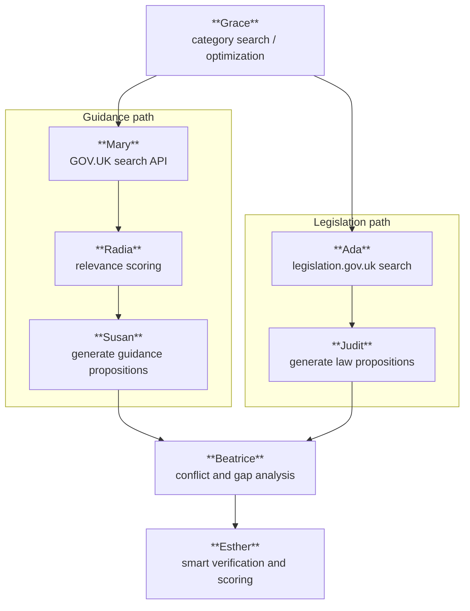

# ai-eu-trade-accelerator

A source-first content-audit pipeline that compares official UK guidance against the
underlying legislation. The pipeline starts with **Grace**, branches into a **guidance path**
and a **legislation path**, recombines at **Beatrice**, and finishes with **Esther**.

## Pipeline

```mermaid
flowchart TD
    Grace["**Grace**<br/>category search / optimization"]

    Grace --> Mary
    Grace --> Ada

    subgraph guidance ["Guidance path"]
        direction TB
        Mary["**Mary**<br/>GOV.UK search API"]
        Radia["**Radia**<br/>relevance scoring"]
        Susan["**Susan**<br/>generate guidance propositions"]
        Mary --> Radia --> Susan
    end

    subgraph legislation ["Legislation path"]
        direction TB
        Ada["**Ada**<br/>legislation.gov.uk search"]
        Judit["**Judit**<br/>generate law propositions"]
        Ada --> Judit
    end

    Susan --> Beatrice
    Judit --> Beatrice

    Beatrice["**Beatrice**<br/>conflict and gap analysis"]
    Esther["**Esther**<br/>smart verification and scoring"]

    Beatrice --> Esther
```

## Steps

| Step | Path | What it does |
| --- | --- | --- |
| **Grace** | Entry | Category search / category optimization. Determines what to audit and branches into the two paths. |
| **Mary** | Guidance | GOV.UK search API — discovers candidate guidance content. |
| **Radia** | Guidance | Relevance scoring of the discovered guidance. |
| **Susan** | Guidance | Generates guidance propositions from the scored content. |
| **Ada** | Legislation | legislation.gov.uk search — discovers the relevant law. |
| **Judit** | Legislation | Generates law propositions from the legislation. |
| **Beatrice** | Merge | Conflict and gap analysis across the guidance and law propositions. |
| **Esther** | Output | Smart verification and scoring of the analysis. |

## Previous run (topic: "slurry")

Input size, runtime, and estimated cost from the previous end-to-end run. Values to be filled
in once measured. Grace was a manual step. Ada returned **5** legislation results, which became
Judit's input.

| Step | Input size | Runtime | Estimated cost |
| --- | --- | --- | --- |
| **Grace** | "slurry" (category) | Manual | Manual |
| **Mary** |  |  |  |
| **Radia** |  |  |  |
| **Susan** |  |  |  |
| **Ada** |  |  |  |
| **Judit** | 5 law results |  |  |
| **Beatrice** |  |  |  |
| **Esther** |  |  |  |
| **Total** |  |  |  |

## Components

Each step lives in its own directory:

- [`grace/`](grace/) — category search / optimization
- [`mary/`](mary/) — GOV.UK search API
- [`radia/`](radia/) — relevance scoring
- [`susan/`](susan/) — generate guidance propositions
- [`ada/`](ada/) — legislation.gov.uk search
- [`judit/`](judit/) — generate law propositions
- [`beatrice/`](beatrice/) — conflict and gap analysis
- [`esther/`](esther/) — smart verification and scoring

## Infographic

The polished pipeline infographic is generated from a shared prompt template:

- [`docs/assets/infographics/prompt-template.md`](docs/assets/infographics/prompt-template.md)

Paste that prompt into an external image/design tool (DALL-E, Midjourney, etc.) to produce
slide- and poster-friendly variants. This follows the same approach used in `judit/` and `ada/`.
