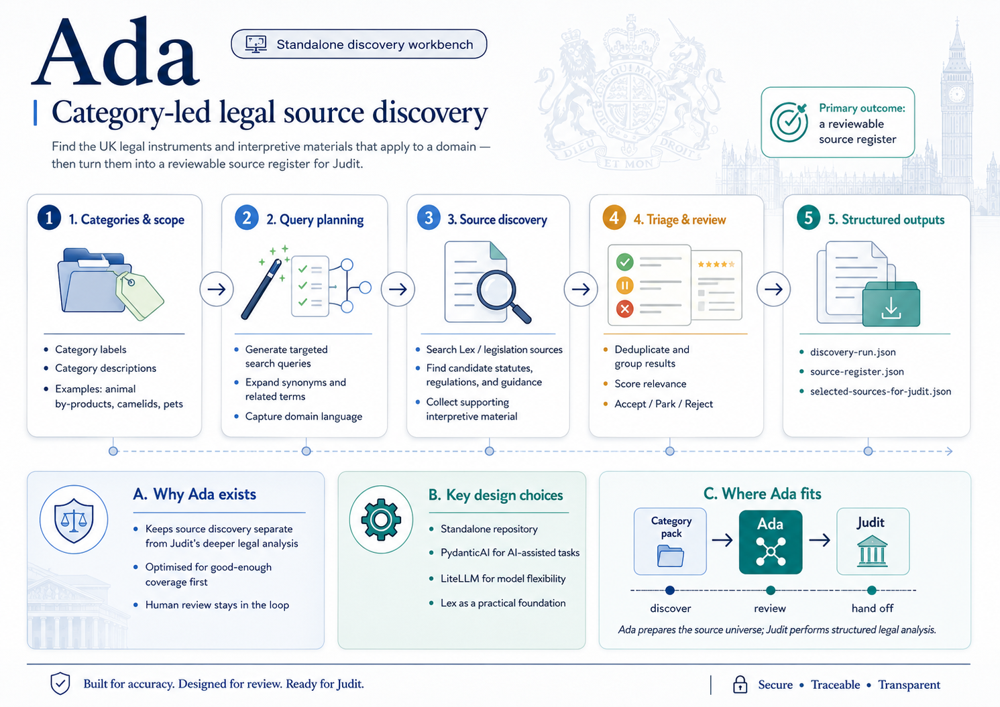

# Ada — UK legal source discovery



Ada is a **standalone** legal source discovery workbench. Given a category brief, Ada finds **candidate** UK legal instruments and interpretive materials, scores them deterministically, supports human review, and exports a source register and Judit handoff JSON.

Ada is **not** part of the Judit monorepo and has **no runtime dependency** on Judit or Beatrice code.

## Relationship to Judit and Beatrice

| Product | Role |
|---------|------|
| **Ada** | Finds candidate legal sources and helps curate a reviewable register |
| **Judit** | Extracts source-backed legal propositions from accepted Ada sources |
| **Beatrice** | Checks guidance against Judit propositions |

Ada does **not** make legal conclusions, extract propositions, or compare guidance against law.

## What Ada does not guarantee

Ada does **not** guarantee complete legal coverage. Lex results are **candidates**, not canonical legal truth. Human review is required before exporting sources for Judit.

## Requirements

- Python 3.12+
- [uv](https://docs.astral.sh/uv/)

## Install

```bash
uv sync
```

Copy `.env.example` to `.env` when using Lex-backed discovery or AI-assisted workflows. Deterministic `--no-network` commands work without Lex or LiteLLM configuration.

## Quality checks

```bash
uv run pytest
uv run ruff check .
uv run basedpyright
```

## CLI overview

```bash
uv run ada --help
```

| Command | Purpose |
|---------|---------|
| `build-query-plan` | Build deterministic search plan from a category brief |
| `expand-category` | AI-assisted category expansion (requires LiteLLM) |
| `discover` | Run discovery and write a `DiscoveryRun` |
| `make-register` | Build a `SourceRegister` from a discovery run |
| `export-for-judit` | Export accepted sources for Judit handoff JSON |
| `expand-related-sources` | Discover related materials around accepted register sources |
| `make-source-bundle` | Build a structured `SourceBundle` from register + related expansion |
| `export-bundle-for-judit` | Export bundle with relationships for richer Judit handoff |
| `ada-viewer` | Local Streamlit UI to review discovery runs, related expansion, or bundles |

## Reviewing a discovery run

Review candidates in a discovery run without editing the original JSON on disk. Session state holds review decisions; download a `SourceRegister` or Judit handoff JSON when ready.

```bash
uv run ada-viewer runs/animal_by_products/discovery-run.json
```

Equivalent:

```bash
uv run streamlit run src/ada/viewer.py -- runs/animal_by_products/discovery-run.json
```

## Deterministic no-network workflow

No Lex, LiteLLM, or provider credentials required.

```bash
uv run ada build-query-plan examples/equine-identification.category.json \
  --output /tmp/equine-query-plan.json

uv run ada discover examples/equine-identification.category.json \
  --output /tmp/equine-discovery-run.json \
  --no-network

uv run ada make-register /tmp/equine-discovery-run.json \
  --output /tmp/equine-source-register.json

uv run ada export-for-judit /tmp/equine-source-register.json \
  --output /tmp/selected-sources-for-judit.json
```

Review and update the source register before export. By default, `make-register` places all candidates in `parked_sources`. Use `--accept-high-confidence` only when you intentionally want high-confidence candidates pre-placed in `accepted_sources` for review.

## Lex-backed workflow

Lex is a **candidate discovery substrate**, not canonical legal truth. Ada calls `POST {ADA_LEX_BASE_URL}/legislation/search` with a JSON body containing `query` and `limit`.

```bash
export ADA_LEX_BASE_URL="<lex-base-url>"
export ADA_LEX_API_KEY="<optional-key>"

uv run ada discover examples/equine-identification.category.json \
  --output /tmp/equine-discovery-run.json
```

Or pass overrides on the command line:

```bash
uv run ada discover examples/equine-identification.category.json \
  --output /tmp/equine-discovery-run.json \
  --lex-base-url "<lex-base-url>" \
  --lex-api-key "<optional-key>"
```

## AI-assisted workflow (Pydantic AI + LiteLLM)

Ada uses **Pydantic AI** as the typed AI layer and routes all model calls through a **LiteLLM OpenAI-compatible proxy**. Ada does **not** call OpenAI, Anthropic, Google, Gemini, Ollama, LiteLLM SDK, or other provider SDKs directly from application code.

```bash
export ADA_AI_PROVIDER=litellm
export ADA_AI_MODEL=ada-discovery-fast
export ADA_LITELLM_BASE_URL=http://localhost:4000/v1
export ADA_LITELLM_API_KEY=sk-local-dev

uv run ada expand-category examples/equine-identification.category.json \
  --output /tmp/equine-expansion.json

uv run ada build-query-plan examples/equine-identification.category.json \
  --expansion /tmp/equine-expansion.json \
  --output /tmp/equine-query-plan.json

uv run ada discover examples/equine-identification.category.json \
  --expansion /tmp/equine-expansion.json \
  --use-ai-assessment \
  --output /tmp/equine-discovery-run.json
```

AI assessment never auto-accepts or auto-rejects sources for Judit export.

## Related source expansion

After you have an accepted (or high-confidence parked) source register, Ada can expand around those **seed** sources to discover surrounding legal and interpretive materials: amendments, commencement orders, revocations, correction slips, explanatory notes, impact assessments, guidance, forms, and similar.

**Product boundary:** Ada discovers and labels the source universe and relationships. Ada does **not** determine final legal effect. Judit resolves legal effect, versioning, commencement, extent, amendments, and extracts propositions.

```fish
set -gx ADA_AI_MODEL frontier_reason
set -gx ADA_LITELLM_BASE_URL http://localhost:4000/v1
set -gx ADA_LITELLM_API_KEY sk-local-dev

uv run ada expand-related-sources \
  runs/equine_passports/source-register.json \
  examples/categories/equine_passports.category.json \
  --output runs/equine_passports/related-sources-run.json \
  --use-ai-triage

uv run ada make-source-bundle \
  runs/equine_passports/source-register.json \
  --related-run runs/equine_passports/related-sources-run.json \
  --output runs/equine_passports/source-bundle.json

uv run ada export-bundle-for-judit \
  runs/equine_passports/source-bundle.json \
  --output runs/equine_passports/source-bundle-for-judit.json
```

Deterministic `--no-network` mode builds the related query plan and seed list without Lex calls (useful for CI and offline planning).

Review related expansion or bundles in the viewer:

```fish
uv run ada-viewer runs/equine_passports/related-sources-run.json
uv run ada-viewer runs/equine_passports/source-bundle.json
```

## Architecture notes

```
Category brief
    → query plan (deterministic)
    → Lex search (optional, candidate generator)
    → normalise + score + dedupe
    → optional Pydantic AI assessment via LiteLLM proxy
    → human review
    → source register
    → selected-sources-for-judit JSON handoff

Accepted / likely-accepted sources
    → related-source query plan (deterministic)
    → Lex search for related materials
    → relationship classification (+ optional AI triage)
    → human review
    → source bundle
    → source-bundle-for-judit JSON handoff (richer than selected-sources export)
```

- **Lex** — candidate generator; not treated as canonical legal truth
- **Pydantic AI** — typed agents and structured outputs validated into Pydantic models
- **LiteLLM** — model gateway (OpenAI-compatible HTTP proxy)
- **Judit** — consumes handoff JSON later; not a dependency of this repository

## Documentation

- [Product brief](docs/product-brief.md)
- [V1 process](docs/v1-process.md)
- [Source register schema](docs/source-register-schema.md)
- [Judit handoff contract](docs/judit-handoff-contract.md)
- [LiteLLM integration](docs/litellm.md)
- [Lex API notes](docs/lex-api-notes.md)

## License

Internal — DEFRA.
