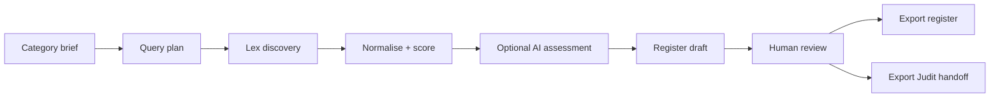

# Ada V1 process

V1 is a CLI-driven pipeline from category brief to exportable source register and optional Judit handoff. Ada is standalone; Judit consumes exports asynchronously via JSON.

## V1 scope

| Capability | Required? | Notes |
|------------|-----------|-------|
| Category brief input | yes | JSON file; see example category |
| Deterministic query-plan generation | yes | No AI required |
| Lex API / Lex Graph discovery | yes | First discovery substrate; fixtures in tests |
| Candidate source normalisation | yes | Common `SourceCandidate` shape |
| Simple deterministic scoring | yes | Keyword/synonym overlap, exclusion penalty |
| Optional Pydantic AI category expansion | no | Requires LiteLLM proxy |
| Optional Pydantic AI relevance assessment | no | Structured rationale into Pydantic models |
| AI routed through LiteLLM | default | When AI is enabled |
| Human review status | yes | `unreviewed`, `parked`, `accepted`, `rejected`, `needs_more_research` |
| JSON source register export | yes | Canonical Ada output |
| Selected-sources handoff for Judit | yes | Accepted entries only |
| Related-source expansion around accepted seeds | yes | Search-based v1; optional AI relationship triage |
| Source bundle export for Judit | yes | Buckets + relationships; no legal effect resolved |

## V1 non-goals

- No guarantee of completeness
- No final legal conclusions or legal advice
- No proposition extraction
- No guidance/law comparison
- No database
- No web UI
- No direct dependency on Judit code

## End-to-end flow



### 1. Define category brief

Create a JSON file with `category_id`, `label`, `description`, `synonyms`, optional `exclusions` and `jurisdiction_hints`.

Example: [examples/equine-identification.category.json](../examples/equine-identification.category.json)

### 2. Validate category brief

Load and inspect the category JSON, or build a query plan directly:

```bash
uv run ada build-query-plan examples/equine-identification.category.json
```

### 3. Generate query plan

```bash
uv run ada build-query-plan examples/equine-identification.category.json \
  --output query-plan.json
```

Builds a deterministic plan from synonyms and exclusions. No network or AI required.

### 4. Optional category expansion (AI)

When `ADA_AI_*` and LiteLLM env vars are set, Ada may suggest additional synonyms or search terms. Output validates into a Pydantic model (see [equine-expansion.example.json](../examples/equine-expansion.example.json)).

Deterministic fallback when AI is not configured.

### 5. Discover candidates

```bash
uv run ada discover examples/equine-identification.category.json \
  --output run.json \
  --no-network
```

For live Lex discovery, omit `--no-network` and configure `ADA_LEX_BASE_URL`.

Queries Lex API / Lex Graph via the Lex adapter. Returns normalised candidates with deterministic scores.

**Lex is a discovery substrate, not canonical legal truth.** Candidates require human review.

### 6. Build and review source register

Use `make-register` to split discovery candidates into register buckets. Reviewers move sources between `accepted_sources`, `rejected_sources`, and `parked_sources`, and may add `notes`.

Review statuses on `CandidateSource`:

- **unreviewed** — default from discovery
- **parked** — default from `make-register` (awaiting review)
- **accepted** — eligible for Judit handoff
- **rejected** — excluded from handoff
- **needs_more_research** — requires further investigation

### 7. Export register and Judit handoff

```bash
uv run ada make-register run.json --output register.json
uv run ada export-for-judit register.json --output handoff.json
```

Exports **accepted** entries only, using the contract in [judit-handoff-contract.md](judit-handoff-contract.md).

## Non-AI path

Steps 1–3, 5–7 work with zero AI configuration. Query planning and scoring are fully deterministic.

## Testing

Unit tests use Lex fixtures and skip live model calls. `pytest` requires no network access.
