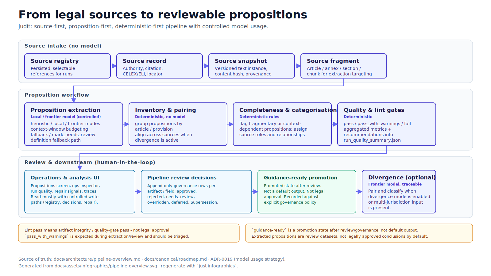

# Judit

Source-first, proposition-first legal analysis workbench

Stakeholder overview deck. Source-of-truth: `docs/canonical/`, `docs/architecture/`, `docs/dev/`.

## What Judit is

Judit turns legal text into reviewable, traceable analysis.

- **Source-first** — every analysis is grounded in registered legal sources with versioned snapshots and fragment-level lineage.
- **Proposition-first** — atomic legal statements are the unit of analysis, review, and (optionally) comparison.
- **Reviewable** — outputs are review datasets until humans accept them under governance policy.
- **Auditable** — runs persist source records, snapshots, fragments, propositions, traces, jobs, and quality summaries.

## Why this shape works

- A clear evidence chain from authoritative source to proposition, with provenance retained at every step.
- Useful outputs without forcing a comparison/divergence workflow.
- Structured comparison units (propositions) when divergence is needed.
- Local/cloud model routing via LiteLLM, with traceable model usage only in explicitly defined stages.
- Future-ready static rendering boundary via the export bundle.

## Core workflow

*Figure: Source-first substrate and proposition-first workflow, with reviewable evidence loop and optional downstream divergence built on proposition inventory.*

## Pipeline at a glance

*Figure: End-to-end pipeline — source intake (no model), proposition extraction (local model, controlled), inventory/pairing/completeness/categorisation (deterministic), quality gates, review, optional divergence (frontier, traceable).*

## Pipeline stages and model boundaries

| Stage | What it does | Model usage |
| ----- | ------------ | ----------- |
| Source intake | Fetch, parse, and register sources | No model |
| Proposition extraction | Extract candidate legal propositions | Local model (controlled, cached) |
| Inventory & pairing | Group and align propositions | No model |
| Completeness | Assess whether propositions are self-contained | Deterministic rules |
| Source categorisation | Assign roles and relationships between sources | Deterministic rules |
| Divergence classification | Classify differences between propositions | Optional frontier model (traceable) |
| Narrative output | Generate reports using templates | No model |

Deterministic-first processing; controlled model usage only where policy allows, with a full audit trail. See [ADR-0019](../../decisions/adr-0019-model-usage-strategy.md).

## What a proposition looks like

**Example**

Article 109 §1(d)(i)

**Structured proposition**

- Subject: Member States
- Rule: must record
- Object: equine identification data
- Condition: within Article 109 system
- Scope: equine

A proposition carries opaque machine identity (`Proposition.id`), source lineage (`proposition_key`), and human-readable `label`/`short_name`. See ADR-0018.

## What v1 delivers

- Source registry as the explicit control plane for runs.
- Single-jurisdiction proposition inventory as a first-class workflow.
- Divergence as a downstream mode (enabled explicitly or when multi-jurisdiction input is present).
- Operations and history APIs for runs, sources, traces, and decisions.
- Read-mostly analysis workbench (`/`) and operations/registry inspector (`/ops`).
- LiteLLM gateway and export bundle boundary.

## What v1.5 consolidates

- Improved structured proposition reliability and display consistency.
- Provision type classification: core rule, definition, exception, transitional, cross-reference.
- Quieter scope links by default (reviewer can expand).
- Review decisions across proposition, structured display, scope links, and completeness.
- Article/provision grouping as the primary navigation pattern.

Status snapshot (2026-05): structured proposition reliability, provision type surfacing, broader review decisions, and article/provision grouping are implemented, tested, and documented. Timeline view in product UI is planned.

## What v2 and beyond add

- Article-level proposition clusters, related provisions, related sources.
- Cross-reference navigation; comparison across jurisdictions and time.
- Timeline of legal change, "what applies now / later", temporal reasoning across versions.

Explicitly deferred: timeline UI until structured propositions, provision types, and article-level grouping are reliable; LangSmith evaluation; Astro renderer; Slidev; advanced orchestration.

## Not a black box

- Deterministic-first pipeline with controlled model usage.
- Models only in explicit stages; every assisted step is traceable.
- Full traceability to sources, snapshots, fragments, and pipeline stages.
- Human review is first-class governance.
- `guidance-ready` is a promotion state earned through review — not default output.
- Lint pass means artifact integrity / quality-gate pass — not legal approval.

## Where to go next

- Architecture: `docs/architecture/pipeline-overview.md`, `docs/architecture/system-overview.md`
- Reference: `docs/reference/artifacts.md`, `docs/reference/api-ops.md`, `docs/reference/cli.md`
- Roadmap: `docs/canonical/roadmap.md`, `docs/roadmap/v1.md`
- Decisions: `docs/decisions/adr-0019-model-usage-strategy.md` (model usage), `adr-0018-proposition-identity-and-naming.md` (identity)
