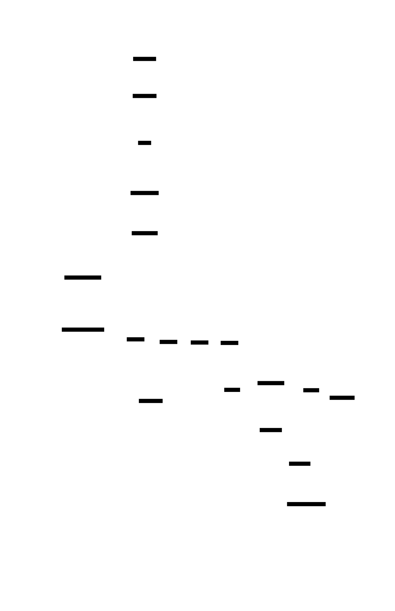
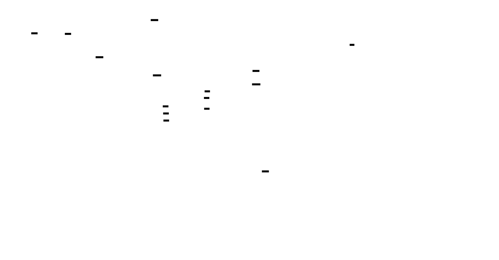

# Diagram assets

D2 files in this directory are the source of truth for architecture visuals.

## Source files

- `docs/assets/diagrams/core-workflow.d2`
- `docs/assets/diagrams/technical-architecture.d2`
- `docs/assets/diagrams/temporal-audit.d2`
- `docs/assets/diagrams/pipeline-overview-v2.d2`
- `docs/assets/diagrams/artifact-map.d2`
- `docs/assets/diagrams/fragment-selection-modes.d2`
- `docs/assets/diagrams/extraction-repair-flow.d2`
- `docs/assets/diagrams/proposition-review-workflow.d2`

## Generated outputs

- `docs/assets/generated/diagrams/core-workflow.svg`
- `docs/assets/generated/diagrams/technical-architecture.svg`
- `docs/assets/generated/diagrams/temporal-audit.svg`
- `docs/assets/generated/diagrams/pipeline-overview-v2.svg`
- `docs/assets/generated/diagrams/artifact-map.svg`
- `docs/assets/generated/diagrams/fragment-selection-modes.svg`
- `docs/assets/generated/diagrams/extraction-repair-flow.svg`
- `docs/assets/generated/diagrams/proposition-review-workflow.svg`

Generated SVGs are committed under `docs/assets/generated/diagrams/`. Regenerate with `just diagrams`. The full assets refresh (`just docs-refresh`) also runs infographic and deck generation.

## Current visuals

### Product workflow

*Figure: Core Judit identity: source-first substrate, proposition-first workflow, reviewable evidence/context, and optional downstream divergence.*

### Technical architecture

*Figure: Clear runtime grouping across product surfaces, FastAPI API orchestration, source registry, pipeline runner, caches, model routing, and run artifacts/traces/export bundle.*

### Temporal audit

*Figure: Time-linked source, proposition, and divergence histories tied to review decisions and audit traceability.*

### Pipeline overview v2

*Figure: End-to-end pipeline from source registry and snapshots through fragment selection and extraction, quality/lint gating, export, ops UI inspection, human review promotion, and optional downstream divergence.*

### Artifact map

*Figure: Artifact lineage across source/snapshot/fragment/extraction outputs, run and async-job storage, profile-specific/compatibility surfaces, and quality/export/progress UI inspection.*

### Fragment selection modes

*Figure: Side-by-side policy behavior for `required_only`, `required_plus_focus`, and `all_matching`, including selection/skip audit fields written to `proposition_extraction_jobs.json`.*

### Extraction repair flow

*Figure: Fragment-to-validation flow with clean/fallback/repair/fail outcomes, deterministic definition fallback path, and review gating notes for fallback/repairable/low-confidence traces.*

### Proposition review workflow

*Figure: Proposition-layer review decisions through append-only persistence, supersession, reload, and guidance-ready candidacy under governance constraints.*

## Retired diagrams

- `system-context.d2` / `system-context.svg` (replaced by `core-workflow` and `technical-architecture`)
- `current-vs-future.d2` / `current-vs-future.svg` (replaced by `core-workflow` and `temporal-audit`)
