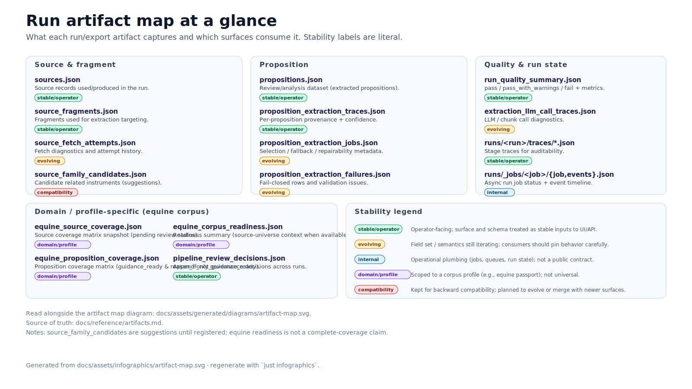
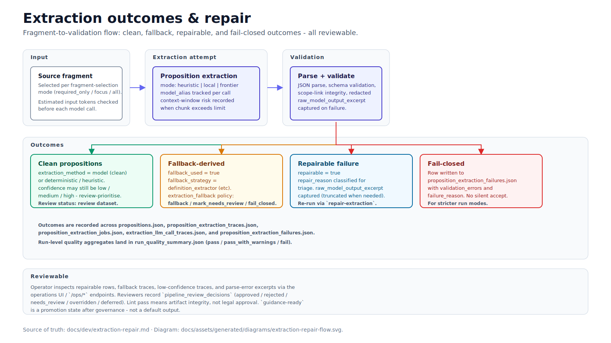
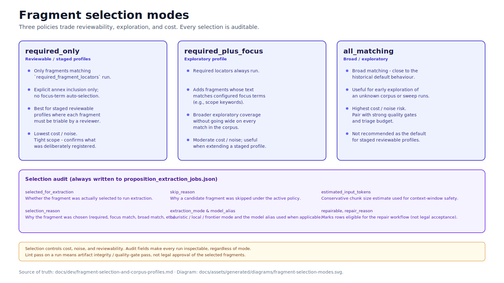
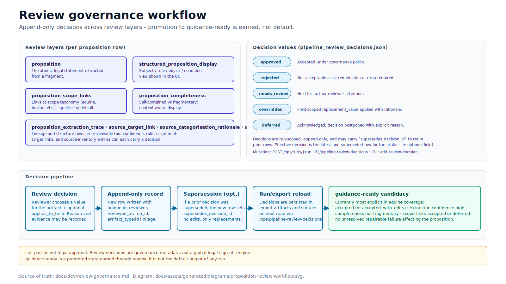
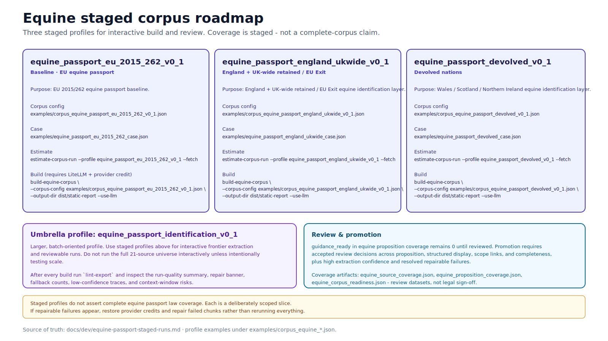
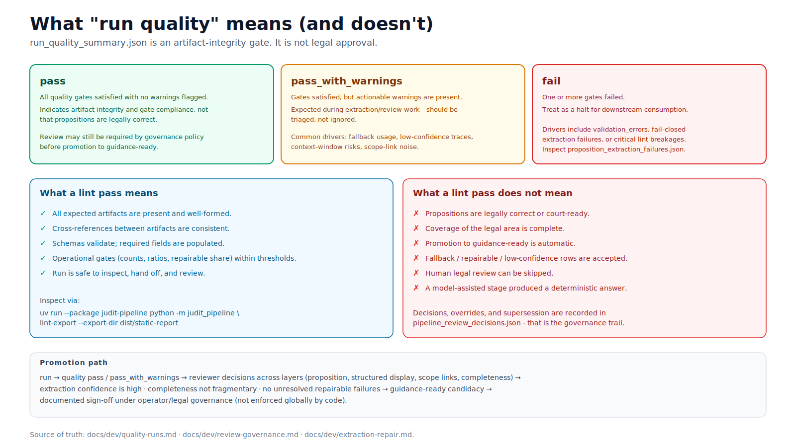

<!-- markdownlint-disable MD033 -->

# Infographic assets

Polished, source-grounded infographics for stakeholder and operator use. This page is the canonical index for every infographic in the repo: title, one-line purpose, source SVG, generated SVG, and generated PNG.

## Authoring model

- The authoring source for each infographic is a hand-edited SVG under `docs/assets/infographics/<name>.svg`.
- `just infographics` copies the SVG to `docs/assets/generated/infographics/<name>.svg` and renders a deterministic PNG raster (1600×900) via `rsvg-convert`.
- Text in infographics is real SVG text, not image-model-rendered glyphs, so it stays editable, accessible, and grep-able.
- Polished image-model-rendered variants (e.g., for poster/social use) can still be authored externally; if approved, save them alongside the source SVG and add a row to `docs/assets/generated-assets.md`.

## Index

Thumbnails below preview the generated SVG at reduced width; click any path link to open the full asset.

### Pipeline overview

End-to-end Judit pipeline with model boundaries and review notes.

- Source SVG: [`docs/assets/infographics/pipeline-overview.svg`](pipeline-overview.svg)
- Generated SVG: [`docs/assets/generated/infographics/pipeline-overview.svg`](../generated/infographics/pipeline-overview.svg)
- Generated PNG: [`docs/assets/generated/infographics/pipeline-overview.png`](../generated/infographics/pipeline-overview.png)
- Polished PNG variant: [`docs/assets/infographics/overview-polished.png`](overview-polished.png)

### Artifact map

Run/export artifact map at a glance, with stability legend.

- Source SVG: [`docs/assets/infographics/artifact-map.svg`](artifact-map.svg)
- Generated SVG: [`docs/assets/generated/infographics/artifact-map.svg`](../generated/infographics/artifact-map.svg)
- Generated PNG: [`docs/assets/generated/infographics/artifact-map.png`](../generated/infographics/artifact-map.png)

### Extraction repair flow

Extraction outcomes (clean / fallback / repairable / fail-closed) and the review path.

- Source SVG: [`docs/assets/infographics/extraction-repair-flow.svg`](extraction-repair-flow.svg)
- Generated SVG: [`docs/assets/generated/infographics/extraction-repair-flow.svg`](../generated/infographics/extraction-repair-flow.svg)
- Generated PNG: [`docs/assets/generated/infographics/extraction-repair-flow.png`](../generated/infographics/extraction-repair-flow.png)

### Fragment selection modes

`required_only`, `required_plus_focus`, and `all_matching` policies side-by-side, with audit fields.

- Source SVG: [`docs/assets/infographics/fragment-selection-modes.svg`](fragment-selection-modes.svg)
- Generated SVG: [`docs/assets/generated/infographics/fragment-selection-modes.svg`](../generated/infographics/fragment-selection-modes.svg)
- Generated PNG: [`docs/assets/generated/infographics/fragment-selection-modes.png`](../generated/infographics/fragment-selection-modes.png)

### Review governance workflow

Review layers, decision values, append-only persistence, and the promotion path to `guidance-ready`.

- Source SVG: [`docs/assets/infographics/review-governance-workflow.svg`](review-governance-workflow.svg)
- Generated SVG: [`docs/assets/generated/infographics/review-governance-workflow.svg`](../generated/infographics/review-governance-workflow.svg)
- Generated PNG: [`docs/assets/generated/infographics/review-governance-workflow.png`](../generated/infographics/review-governance-workflow.png)

### Equine staged corpus roadmap

Three staged equine passport profiles, build commands, and review caveats.

- Source SVG: [`docs/assets/infographics/equine-staged-corpus-roadmap.svg`](equine-staged-corpus-roadmap.svg)
- Generated SVG: [`docs/assets/generated/infographics/equine-staged-corpus-roadmap.svg`](../generated/infographics/equine-staged-corpus-roadmap.svg)
- Generated PNG: [`docs/assets/generated/infographics/equine-staged-corpus-roadmap.png`](../generated/infographics/equine-staged-corpus-roadmap.png)

### Run quality explainer

What `run_quality_summary` statuses mean (and do not mean).

- Source SVG: [`docs/assets/infographics/run-quality-explainer.svg`](run-quality-explainer.svg)
- Generated SVG: [`docs/assets/generated/infographics/run-quality-explainer.svg`](../generated/infographics/run-quality-explainer.svg)
- Generated PNG: [`docs/assets/generated/infographics/run-quality-explainer.png`](../generated/infographics/run-quality-explainer.png)

## Generated outputs

For each source `<name>.svg`, `just infographics` writes:

- `docs/assets/generated/infographics/<name>.svg`
- `docs/assets/generated/infographics/<name>.png`

Regenerate with `just infographics`. `just docs-refresh` includes this step. PNG rendering requires `rsvg-convert` (install via `brew install librsvg`); if absent, only the SVG copy is produced.

## Text companion specs

- `docs/assets/infographics/pipeline-overview.md` — narrative spec for the pipeline infographic.
- `docs/assets/infographics/prompt-template.md` — prompt template for externally authoring a polished variant.
- `docs/assets/infographics/repo-audit-prompt-template.md` - prompt template to audit a repo and generate a relevant infographic prompt.
- Generated canonical context bundle for external prompts: `docs/assets/generated/context/infographic-prompt-context.md` (regenerate with `just infographic-context`).

## Editorial rules

- No "complete equine law" or similar coverage claims. Staged profiles are explicitly scoped.
- "Lint pass" means artifact integrity / quality-gate pass, not legal approval.
- `guidance-ready` is a promotion state after review, not default output.
- Cite source docs in each infographic footer.
- Keep terminology consistent with `docs/canonical/`.
