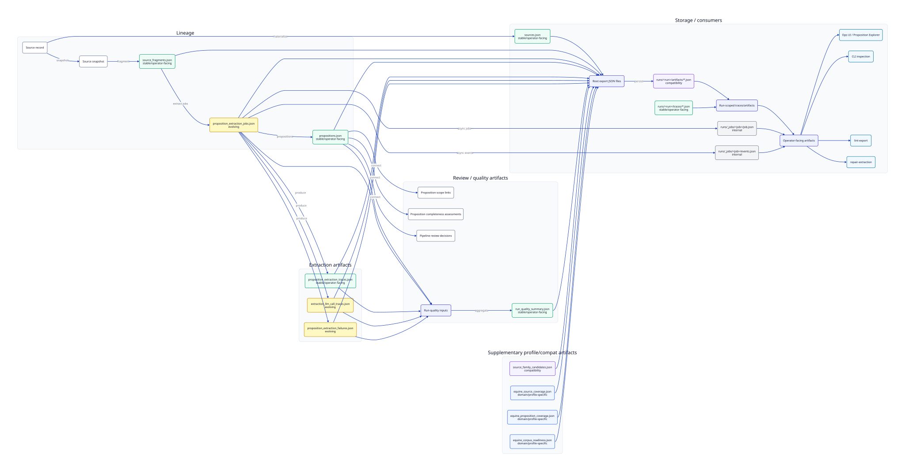

# Artifact map

This page maps key run/export artifacts to producer/consumer surfaces and stability level.

Stability labels:

- `stable/operator-facing`
- `evolving`
- `internal`
- `domain/profile-specific`
- `compatibility`

Diagram source: `docs/assets/diagrams/artifact-map.d2` (generated SVG may be absent in a clean checkout; run `just diagrams`).

| Artifact | Purpose | Producer | Consumer | Stability |
| --- | --- | --- | --- | --- |
| `MODEL.md` | Human-readable run metadata (description, input pipeline/asset, models, runtime, indicative cost, settings, **proposition normalisation** version/passes and quality summary). | `judit_pipeline.run_model_md` via `persist_run_outputs` / `export_bundle` | operators, run folders, static exports | stable/operator-facing |
| `normalisation_quality.json` | Post-normalisation proposition quality gate counts and findings (`legacy_category_conflict`, `scope_application_conflict`, legacy keys, debug leakage, etc.). | `judit_pipeline.export.attach_proposition_normalisation_quality` | **MODEL.md**, comparison scripts, operators | evolving |
| `NORMALISATION_QUALITY.md` | Human-readable expansion of `normalisation_quality.json`. | `judit_pipeline.proposition_quality_gates` | operators | evolving |
| `pipeline_case_inputs.json` | Case inputs snapshot (extraction mode, prompts, **`proposition_normalisation`**). | pipeline runner | repair/replay, run audit | evolving |
| `sources.json` | Source records used/produced by run. | `judit_exporters.static_bundle.export_static_bundle` | `OperationalStore` (`/ops/sources`), UI source inspectors | stable/operator-facing |
| `source_fragments.json` | Fragment rows for extraction targeting and traceability. | exporter static bundle | `OperationalStore` (`/ops/source-fragments`, source detail) | stable/operator-facing |
| `propositions.json` | Proposition review dataset for analysis/divergence. | pipeline runner + exporter | proposition explorer, `OperationalStore` | stable/operator-facing |
| `proposition-relationships.json` | Deterministic proposition/locator relationship edges (cross-references, same-source resolution). | `judit_pipeline.effective_law` via `export_bundle` | Beatrice handoff, relationship review | evolving |
| `effective_law_statements.json` | Guidance-facing effective law bundles (`presentation_role`, `standalone_status`, `required_context`). | `judit_pipeline.effective_law` via `export_bundle` | UI law view, Beatrice provenance | evolving |
| `beatrice_law_candidates.json` | Filtered guidance-matching queue (`guidance_matching_candidate` only) with evidence, risk flags, deterministic territory display fields, soft same-source `dedupe` metadata, `duplicate_summary`, and deterministic `matching_text` for retrieval. `statement_text` is the canonical law statement; `matching_text` enriches it with title, source/locator, territory (when determinable), and context hints (including `external standard reference` / `external guidance reference` for BS/RB209-style cites). Raw `jurisdiction` / `source_jurisdiction` / `extent` / `territorial_application` are preserved when present; `territory_labels` and `jurisdiction_label` are conservative display labels for matching filters. External technical references are classified separately from unresolved internal locators and are not fetched or resolved in Judit. Same-source duplicate groups (identical normalized locator + statement within one instrument) are flagged, not removed; cross-source equivalents are kept separate. | `judit_pipeline.beatrice_law_candidates` via `export_bundle` | Beatrice guidance claim matching | evolving |
| `proposition_extraction_traces.json` | Per-proposition extraction provenance/diagnostics. | pipeline runner + exporter | `OperationalStore`, quality/inspection flows | stable/operator-facing |
| `proposition_extraction_jobs.json` | Per-source/fragment extraction job outcomes (selection/fallback/repairability). | pipeline runner + exporter | repair hints, quality metrics, operator inspection | evolving |
| `extraction_llm_call_traces.json` | LLM/chunk call diagnostics and context-window metadata. | extraction flow + exporter | run quality metrics, repairability analysis | evolving |
| `proposition_extraction_failures.json` | Extraction failure rows for fail-closed/repair analysis. | pipeline runner + exporter | repair workflow, metrics/readouts | evolving |
| `run_quality_summary.json` | Aggregate lint/quality gate status and metrics. | `judit_pipeline.run_quality` + exporter | `/ops/run-quality-summary`, proposition explorer status | stable/operator-facing |
| `source_family_candidates.json` | Candidate related instruments discovered/registered around target source. | runner/source family workflows + exporter | operations inspector registry workflows | compatibility |
| `equine_source_coverage.json` | Source coverage matrix for equine corpus run/profile. | `write_equine_coverage_artifacts` | `/ops/corpus-coverage/equine`, equine coverage panel | domain/profile-specific |
| `equine_proposition_coverage.json` | Proposition coverage matrix for equine corpus run/profile. | `write_equine_coverage_artifacts` | `/ops/corpus-coverage/equine`, equine coverage panel | domain/profile-specific |
| `equine_corpus_readiness.json` | Equine corpus readiness summary (review material by default; guidance-ready is promoted after governance). | `write_equine_coverage_artifacts` | `/ops/corpus-coverage/equine` | domain/profile-specific |
| `runs/<run>/traces/*.json` | Stage trace files (`source intake`, extraction, pairing, etc). | exporter `_write_stage_traces` | run trace inspection UI/API | stable/operator-facing |
| `runs/<run>/artifacts/*.json` | Run-scoped artifact payload files indexed by run artifact rows. | exporter `_write_run_artifacts` | `OperationalStore` run artifact lookup | compatibility |
| `runs/_jobs/<job>/job.json` | Async run job status/summary/metrics snapshot. | `RunJobStore` (`pipeline_run_jobs.py`) | `/ops/run-jobs`, progress UI | internal |
| `runs/_jobs/<job>/events.json` | Async run job event timeline and per-stage updates. | `RunJobStore` + `PersistingPipelineProgress` | `/ops/run-jobs/{job_id}/events`, progress UI | internal |
